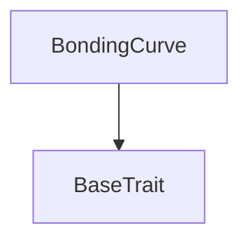
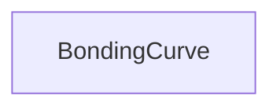

# Tact compilation report
Contract: BondingCurve
BoC Size: 1599 bytes

## Structures (Structs and Messages)
Total structures: 28

### DataSize
TL-B: `_ cells:int257 bits:int257 refs:int257 = DataSize`
Signature: `DataSize{cells:int257,bits:int257,refs:int257}`

### SignedBundle
TL-B: `_ signature:fixed_bytes64 signedData:remainder<slice> = SignedBundle`
Signature: `SignedBundle{signature:fixed_bytes64,signedData:remainder<slice>}`

### StateInit
TL-B: `_ code:^cell data:^cell = StateInit`
Signature: `StateInit{code:^cell,data:^cell}`

### Context
TL-B: `_ bounceable:bool sender:address value:int257 raw:^slice = Context`
Signature: `Context{bounceable:bool,sender:address,value:int257,raw:^slice}`

### SendParameters
TL-B: `_ mode:int257 body:Maybe ^cell code:Maybe ^cell data:Maybe ^cell value:int257 to:address bounce:bool = SendParameters`
Signature: `SendParameters{mode:int257,body:Maybe ^cell,code:Maybe ^cell,data:Maybe ^cell,value:int257,to:address,bounce:bool}`

### MessageParameters
TL-B: `_ mode:int257 body:Maybe ^cell value:int257 to:address bounce:bool = MessageParameters`
Signature: `MessageParameters{mode:int257,body:Maybe ^cell,value:int257,to:address,bounce:bool}`

### DeployParameters
TL-B: `_ mode:int257 body:Maybe ^cell value:int257 bounce:bool init:StateInit{code:^cell,data:^cell} = DeployParameters`
Signature: `DeployParameters{mode:int257,body:Maybe ^cell,value:int257,bounce:bool,init:StateInit{code:^cell,data:^cell}}`

### StdAddress
TL-B: `_ workchain:int8 address:uint256 = StdAddress`
Signature: `StdAddress{workchain:int8,address:uint256}`

### VarAddress
TL-B: `_ workchain:int32 address:^slice = VarAddress`
Signature: `VarAddress{workchain:int32,address:^slice}`

### BasechainAddress
TL-B: `_ hash:Maybe int257 = BasechainAddress`
Signature: `BasechainAddress{hash:Maybe int257}`

### CreateToken
TL-B: `create_token#00000001 queryId:uint64 name:^string symbol:^string imageUri:^string description:^string telegramLink:^string initialBuyTon:coins = CreateToken`
Signature: `CreateToken{queryId:uint64,name:^string,symbol:^string,imageUri:^string,description:^string,telegramLink:^string,initialBuyTon:coins}`

### Buy
TL-B: `buy#00000002 queryId:uint64 minTokensOut:coins = Buy`
Signature: `Buy{queryId:uint64,minTokensOut:coins}`

### Sell
TL-B: `sell#00000003 queryId:uint64 jettonAmount:coins minTonOut:coins = Sell`
Signature: `Sell{queryId:uint64,jettonAmount:coins,minTonOut:coins}`

### Graduate
TL-B: `graduate#00000004 queryId:uint64 = Graduate`
Signature: `Graduate{queryId:uint64}`

### JettonTransfer
TL-B: `jetton_transfer#00000005 queryId:uint64 amount:coins destination:address responseDestination:address customPayload:Maybe ^cell forwardTonAmount:coins forwardPayload:remainder<slice> = JettonTransfer`
Signature: `JettonTransfer{queryId:uint64,amount:coins,destination:address,responseDestination:address,customPayload:Maybe ^cell,forwardTonAmount:coins,forwardPayload:remainder<slice>}`

### JettonTransferNotification
TL-B: `jetton_transfer_notification#00000006 queryId:uint64 amount:coins sender:address forwardPayload:remainder<slice> = JettonTransferNotification`
Signature: `JettonTransferNotification{queryId:uint64,amount:coins,sender:address,forwardPayload:remainder<slice>}`

### JettonBurn
TL-B: `jetton_burn#00000007 queryId:uint64 amount:coins responseDestination:address customPayload:Maybe ^cell = JettonBurn`
Signature: `JettonBurn{queryId:uint64,amount:coins,responseDestination:address,customPayload:Maybe ^cell}`

### TokenLaunched
TL-B: `token_launched#00000100 queryId:uint64 jettonMaster:address curveAddress:address creator:address name:^string symbol:^string = TokenLaunched`
Signature: `TokenLaunched{queryId:uint64,jettonMaster:address,curveAddress:address,creator:address,name:^string,symbol:^string}`

### TradeEvent
TL-B: `trade_event#00000101 queryId:uint64 isBuy:bool tonAmount:coins tokenAmount:coins creatorFee:coins platformFee:coins = TradeEvent`
Signature: `TradeEvent{queryId:uint64,isBuy:bool,tonAmount:coins,tokenAmount:coins,creatorFee:coins,platformFee:coins}`

### GraduatedEvent
TL-B: `graduated_event#00000102 queryId:uint64 tonLiquidity:coins tokenLiquidity:coins = GraduatedEvent`
Signature: `GraduatedEvent{queryId:uint64,tonLiquidity:coins,tokenLiquidity:coins}`

### JettonData
TL-B: `_ totalSupply:coins mintable:bool owner:address content:^cell walletCode:^cell = JettonData`
Signature: `JettonData{totalSupply:coins,mintable:bool,owner:address,content:^cell,walletCode:^cell}`

### JettonMinter$Data
TL-B: `_ totalSupply:coins mintable:bool owner:address content:^cell curveAddress:address = JettonMinter`
Signature: `JettonMinter{totalSupply:coins,mintable:bool,owner:address,content:^cell,curveAddress:address}`

### BondingCurve$Data
TL-B: `_ creator:address platformTreasury:address jettonMaster:address name:^string symbol:^string virtualTon:coins virtualTokens:coins realTonRaised:coins tokensSold:coins graduated:bool totalCreatorFees:coins totalPlatformFees:coins = BondingCurve`
Signature: `BondingCurve{creator:address,platformTreasury:address,jettonMaster:address,name:^string,symbol:^string,virtualTon:coins,virtualTokens:coins,realTonRaised:coins,tokensSold:coins,graduated:bool,totalCreatorFees:coins,totalPlatformFees:coins}`

### CurveState
TL-B: `_ creator:address jettonMaster:address name:^string symbol:^string virtualTon:coins virtualTokens:coins realTonRaised:coins tokensSold:coins graduated:bool graduationTarget:coins totalCreatorFees:coins totalPlatformFees:coins progressBps:int257 = CurveState`
Signature: `CurveState{creator:address,jettonMaster:address,name:^string,symbol:^string,virtualTon:coins,virtualTokens:coins,realTonRaised:coins,tokensSold:coins,graduated:bool,graduationTarget:coins,totalCreatorFees:coins,totalPlatformFees:coins,progressBps:int257}`

### QuoteBuy
TL-B: `_ tokensOut:coins fee:coins creatorFee:coins platformFee:coins = QuoteBuy`
Signature: `QuoteBuy{tokensOut:coins,fee:coins,creatorFee:coins,platformFee:coins}`

### QuoteSell
TL-B: `_ tonOut:coins fee:coins creatorFee:coins platformFee:coins = QuoteSell`
Signature: `QuoteSell{tonOut:coins,fee:coins,creatorFee:coins,platformFee:coins}`

### LaunchpadFactory$Data
TL-B: `_ owner:address platformTreasury:address launchCount:uint32 launchFee:coins = LaunchpadFactory`
Signature: `LaunchpadFactory{owner:address,platformTreasury:address,launchCount:uint32,launchFee:coins}`

### FactoryInfo
TL-B: `_ owner:address platformTreasury:address launchCount:uint32 launchFee:coins graduationTarget:coins tradeFeeBps:int257 = FactoryInfo`
Signature: `FactoryInfo{owner:address,platformTreasury:address,launchCount:uint32,launchFee:coins,graduationTarget:coins,tradeFeeBps:int257}`

## Get methods
Total get methods: 3

## get_curve_state
No arguments

## quote_buy
Argument: tonIn

## quote_sell
Argument: tokenIn

## Exit codes
* 2: Stack underflow
* 3: Stack overflow
* 4: Integer overflow
* 5: Integer out of expected range
* 6: Invalid opcode
* 7: Type check error
* 8: Cell overflow
* 9: Cell underflow
* 10: Dictionary error
* 11: 'Unknown' error
* 12: Fatal error
* 13: Out of gas error
* 14: Virtualization error
* 32: Action list is invalid
* 33: Action list is too long
* 34: Action is invalid or not supported
* 35: Invalid source address in outbound message
* 36: Invalid destination address in outbound message
* 37: Not enough Toncoin
* 38: Not enough extra currencies
* 39: Outbound message does not fit into a cell after rewriting
* 40: Cannot process a message
* 41: Library reference is null
* 42: Library change action error
* 43: Exceeded maximum number of cells in the library or the maximum depth of the Merkle tree
* 50: Account state size exceeded limits
* 128: Null reference exception
* 129: Invalid serialization prefix
* 130: Invalid incoming message
* 131: Constraints error
* 132: Access denied
* 133: Contract stopped
* 134: Invalid argument
* 135: Code of a contract was not found
* 136: Invalid standard address
* 138: Not a basechain address
* 4429: Invalid sender
* 14335: Exceeds supply
* 15664: Only curve can mint
* 23306: No TON sent
* 23701: Insufficient launch fee
* 41529: Slippage exceeded
* 42433: Target not reached
* 47764: Already graduated

## Trait inheritance diagram

## Contract dependency diagram

