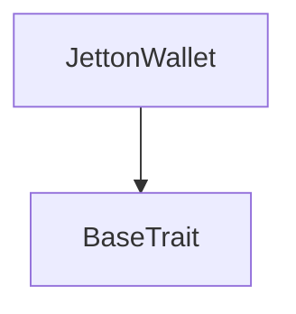
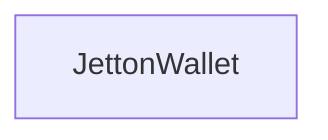

# Tact compilation report
Contract: JettonWallet
BoC Size: 1169 bytes

## Structures (Structs and Messages)
Total structures: 36

### DataSize
TL-B: `_ cells:int257 bits:int257 refs:int257 = DataSize`
Signature: `DataSize{cells:int257,bits:int257,refs:int257}`

### SignedBundle
TL-B: `_ signature:fixed_bytes64 signedData:remainder<slice> = SignedBundle`
Signature: `SignedBundle{signature:fixed_bytes64,signedData:remainder<slice>}`

### StateInit
TL-B: `_ code:^cell data:^cell = StateInit`
Signature: `StateInit{code:^cell,data:^cell}`

### Context
TL-B: `_ bounceable:bool sender:address value:int257 raw:^slice = Context`
Signature: `Context{bounceable:bool,sender:address,value:int257,raw:^slice}`

### SendParameters
TL-B: `_ mode:int257 body:Maybe ^cell code:Maybe ^cell data:Maybe ^cell value:int257 to:address bounce:bool = SendParameters`
Signature: `SendParameters{mode:int257,body:Maybe ^cell,code:Maybe ^cell,data:Maybe ^cell,value:int257,to:address,bounce:bool}`

### MessageParameters
TL-B: `_ mode:int257 body:Maybe ^cell value:int257 to:address bounce:bool = MessageParameters`
Signature: `MessageParameters{mode:int257,body:Maybe ^cell,value:int257,to:address,bounce:bool}`

### DeployParameters
TL-B: `_ mode:int257 body:Maybe ^cell value:int257 bounce:bool init:StateInit{code:^cell,data:^cell} = DeployParameters`
Signature: `DeployParameters{mode:int257,body:Maybe ^cell,value:int257,bounce:bool,init:StateInit{code:^cell,data:^cell}}`

### StdAddress
TL-B: `_ workchain:int8 address:uint256 = StdAddress`
Signature: `StdAddress{workchain:int8,address:uint256}`

### VarAddress
TL-B: `_ workchain:int32 address:^slice = VarAddress`
Signature: `VarAddress{workchain:int32,address:^slice}`

### BasechainAddress
TL-B: `_ hash:Maybe int257 = BasechainAddress`
Signature: `BasechainAddress{hash:Maybe int257}`

### JettonTransfer
TL-B: `jetton_transfer#0f8a7ea5 queryId:uint64 amount:coins destination:address responseDestination:address customPayload:Maybe ^cell forwardTonAmount:coins forwardPayload:remainder<slice> = JettonTransfer`
Signature: `JettonTransfer{queryId:uint64,amount:coins,destination:address,responseDestination:address,customPayload:Maybe ^cell,forwardTonAmount:coins,forwardPayload:remainder<slice>}`

### JettonTransferInternal
TL-B: `jetton_transfer_internal#178d4519 queryId:uint64 amount:coins sender:address responseDestination:address forwardTonAmount:coins forwardPayload:remainder<slice> = JettonTransferInternal`
Signature: `JettonTransferInternal{queryId:uint64,amount:coins,sender:address,responseDestination:address,forwardTonAmount:coins,forwardPayload:remainder<slice>}`

### JettonNotification
TL-B: `jetton_notification#7362d09c queryId:uint64 amount:coins sender:address forwardPayload:remainder<slice> = JettonNotification`
Signature: `JettonNotification{queryId:uint64,amount:coins,sender:address,forwardPayload:remainder<slice>}`

### JettonBurn
TL-B: `jetton_burn#595f07bc queryId:uint64 amount:coins responseDestination:address customPayload:Maybe ^cell = JettonBurn`
Signature: `JettonBurn{queryId:uint64,amount:coins,responseDestination:address,customPayload:Maybe ^cell}`

### JettonBurnNotification
TL-B: `jetton_burn_notification#7bdd97de queryId:uint64 amount:coins sender:address responseDestination:address customPayload:Maybe ^cell = JettonBurnNotification`
Signature: `JettonBurnNotification{queryId:uint64,amount:coins,sender:address,responseDestination:address,customPayload:Maybe ^cell}`

### JettonExcesses
TL-B: `jetton_excesses#d53276db queryId:uint64 = JettonExcesses`
Signature: `JettonExcesses{queryId:uint64}`

### ProvideWalletAddress
TL-B: `provide_wallet_address#2c76b973 queryId:uint64 ownerAddress:address includeAddress:bool = ProvideWalletAddress`
Signature: `ProvideWalletAddress{queryId:uint64,ownerAddress:address,includeAddress:bool}`

### TakeWalletAddress
TL-B: `take_wallet_address#d1735400 queryId:uint64 walletAddress:address ownerAddress:Maybe ^cell = TakeWalletAddress`
Signature: `TakeWalletAddress{queryId:uint64,walletAddress:address,ownerAddress:Maybe ^cell}`

### CreateToken
TL-B: `create_token#4c500001 queryId:uint64 salt:uint64 content:^cell initialBuyTon:coins = CreateToken`
Signature: `CreateToken{queryId:uint64,salt:uint64,content:^cell,initialBuyTon:coins}`

### JettonSetup
TL-B: `jetton_setup#4c500002 queryId:uint64 treasury:address liquidityManager:address content:^cell launchFee:coins initialBuyTon:coins = JettonSetup`
Signature: `JettonSetup{queryId:uint64,treasury:address,liquidityManager:address,content:^cell,launchFee:coins,initialBuyTon:coins}`

### Buy
TL-B: `buy#4c500003 queryId:uint64 tonAmount:coins minTokensOut:coins = Buy`
Signature: `Buy{queryId:uint64,tonAmount:coins,minTokensOut:coins}`

### Migrate
TL-B: `migrate#4c500004 queryId:uint64 = Migrate`
Signature: `Migrate{queryId:uint64}`

### FactoryWithdraw
TL-B: `factory_withdraw#4c500005 queryId:uint64 = FactoryWithdraw`
Signature: `FactoryWithdraw{queryId:uint64}`

### TokenLaunched
TL-B: `token_launched#4c500101 queryId:uint64 creator:address salt:uint64 initialBuyTon:coins = TokenLaunched`
Signature: `TokenLaunched{queryId:uint64,creator:address,salt:uint64,initialBuyTon:coins}`

### TradeEvent
TL-B: `trade_event#4c500102 queryId:uint64 trader:address isBuy:bool tonAmount:coins tokenAmount:coins creatorFee:coins platformFee:coins realTonRaised:coins = TradeEvent`
Signature: `TradeEvent{queryId:uint64,trader:address,isBuy:bool,tonAmount:coins,tokenAmount:coins,creatorFee:coins,platformFee:coins,realTonRaised:coins}`

### GraduatedEvent
TL-B: `graduated_event#4c500103 queryId:uint64 realTonRaised:coins = GraduatedEvent`
Signature: `GraduatedEvent{queryId:uint64,realTonRaised:coins}`

### MigratedEvent
TL-B: `migrated_event#4c500104 queryId:uint64 liquidityManager:address tonLiquidity:coins tokenLiquidity:coins = MigratedEvent`
Signature: `MigratedEvent{queryId:uint64,liquidityManager:address,tonLiquidity:coins,tokenLiquidity:coins}`

### JettonData
TL-B: `_ totalSupply:coins mintable:bool adminAddress:address content:^cell walletCode:^cell = JettonData`
Signature: `JettonData{totalSupply:coins,mintable:bool,adminAddress:address,content:^cell,walletCode:^cell}`

### JettonWalletData
TL-B: `_ balance:coins owner:address minter:address code:^cell = JettonWalletData`
Signature: `JettonWalletData{balance:coins,owner:address,minter:address,code:^cell}`

### CurveState
TL-B: `_ factory:address creator:address salt:uint64 treasury:address liquidityManager:address initialized:bool virtualTon:coins virtualTokens:coins realTonRaised:coins totalSupply:coins graduated:bool migrated:bool graduationTarget:coins totalCreatorFees:coins totalPlatformFees:coins tradeCount:uint32 progressBps:int257 = CurveState`
Signature: `CurveState{factory:address,creator:address,salt:uint64,treasury:address,liquidityManager:address,initialized:bool,virtualTon:coins,virtualTokens:coins,realTonRaised:coins,totalSupply:coins,graduated:bool,migrated:bool,graduationTarget:coins,totalCreatorFees:coins,totalPlatformFees:coins,tradeCount:uint32,progressBps:int257}`

### QuoteBuy
TL-B: `_ tokensOut:coins fee:coins creatorFee:coins platformFee:coins = QuoteBuy`
Signature: `QuoteBuy{tokensOut:coins,fee:coins,creatorFee:coins,platformFee:coins}`

### QuoteSell
TL-B: `_ tonOut:coins fee:coins creatorFee:coins platformFee:coins = QuoteSell`
Signature: `QuoteSell{tonOut:coins,fee:coins,creatorFee:coins,platformFee:coins}`

### FactoryInfo
TL-B: `_ owner:address treasury:address liquidityManager:address launchCount:uint32 launchFee:coins graduationTarget:coins tradeFeeBps:int257 creatorFeeBps:int257 = FactoryInfo`
Signature: `FactoryInfo{owner:address,treasury:address,liquidityManager:address,launchCount:uint32,launchFee:coins,graduationTarget:coins,tradeFeeBps:int257,creatorFeeBps:int257}`

### JettonWallet$Data
TL-B: `_ balance:coins owner:address minter:address = JettonWallet`
Signature: `JettonWallet{balance:coins,owner:address,minter:address}`

### LaunchpadJetton$Data
TL-B: `_ factory:address creator:address salt:uint64 initialized:bool treasury:address liquidityManager:address content:^cell totalSupply:coins virtualTon:coins virtualTokens:coins realTonRaised:coins graduated:bool migrated:bool totalCreatorFees:coins totalPlatformFees:coins tradeCount:uint32 = LaunchpadJetton`
Signature: `LaunchpadJetton{factory:address,creator:address,salt:uint64,initialized:bool,treasury:address,liquidityManager:address,content:^cell,totalSupply:coins,virtualTon:coins,virtualTokens:coins,realTonRaised:coins,graduated:bool,migrated:bool,totalCreatorFees:coins,totalPlatformFees:coins,tradeCount:uint32}`

### LaunchpadFactory$Data
TL-B: `_ owner:address treasury:address liquidityManager:address launchCount:uint32 = LaunchpadFactory`
Signature: `LaunchpadFactory{owner:address,treasury:address,liquidityManager:address,launchCount:uint32}`

## Get methods
Total get methods: 1

## get_wallet_data
No arguments

## Exit codes
* 2: Stack underflow
* 3: Stack overflow
* 4: Integer overflow
* 5: Integer out of expected range
* 6: Invalid opcode
* 7: Type check error
* 8: Cell overflow
* 9: Cell underflow
* 10: Dictionary error
* 11: 'Unknown' error
* 12: Fatal error
* 13: Out of gas error
* 14: Virtualization error
* 32: Action list is invalid
* 33: Action list is too long
* 34: Action is invalid or not supported
* 35: Invalid source address in outbound message
* 36: Invalid destination address in outbound message
* 37: Not enough Toncoin
* 38: Not enough extra currencies
* 39: Outbound message does not fit into a cell after rewriting
* 40: Cannot process a message
* 41: Library reference is null
* 42: Library change action error
* 43: Exceeded maximum number of cells in the library or the maximum depth of the Merkle tree
* 50: Account state size exceeded limits
* 128: Null reference exception
* 129: Invalid serialization prefix
* 130: Invalid incoming message
* 131: Constraints error
* 132: Access denied
* 133: Contract stopped
* 134: Invalid argument
* 135: Code of a contract was not found
* 136: Invalid standard address
* 138: Not a basechain address
* 2303: Sell through the curve
* 4429: Invalid sender
* 7657: Not initialized
* 10854: Initial buy too small
* 11788: Only factory
* 16323: Insufficient reserve
* 17062: Invalid amount
* 20955: Already migrated
* 30356: Insufficient TON attached
* 35499: Only owner
* 41529: Slippage exceeded
* 46558: Initial buy too large
* 48404: Unknown burn payload
* 51863: Insufficient jetton balance
* 58403: Curve graduated
* 59371: Trade too small
* 62610: Not graduated

## Trait inheritance diagram

## Contract dependency diagram

